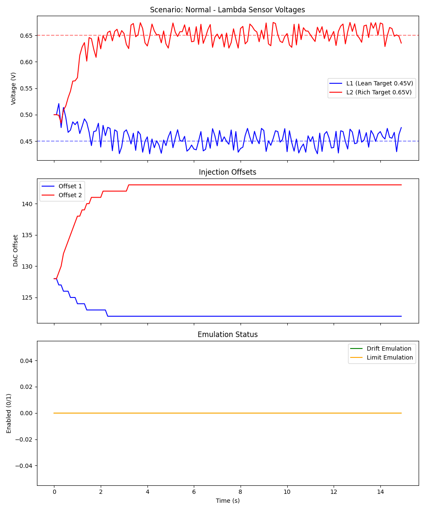
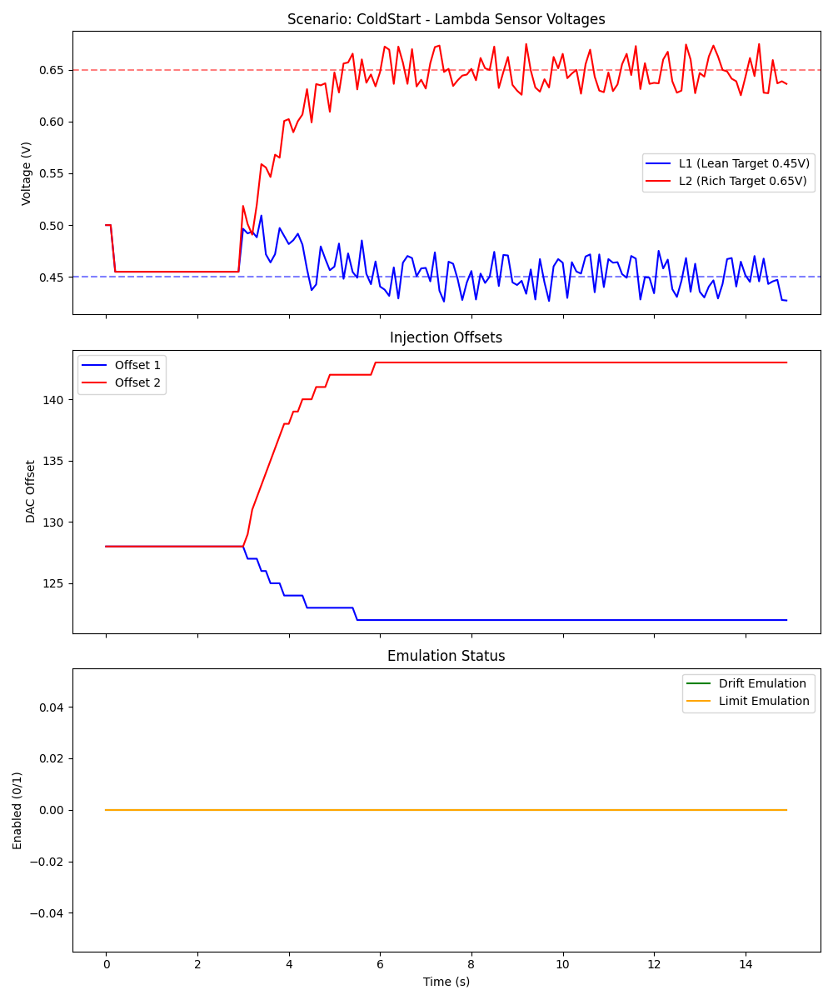
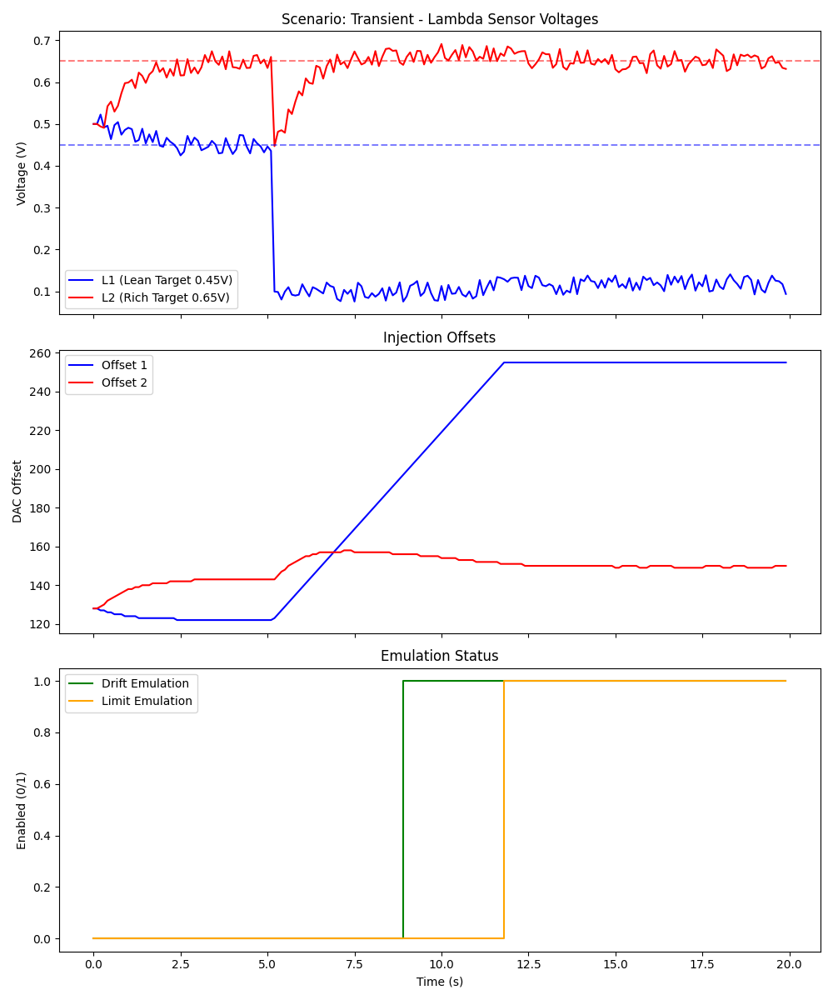
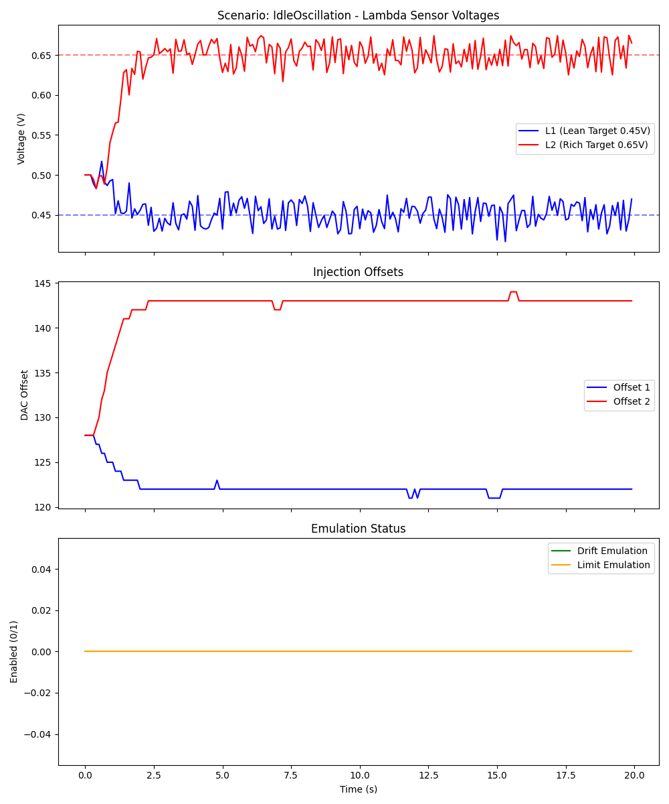
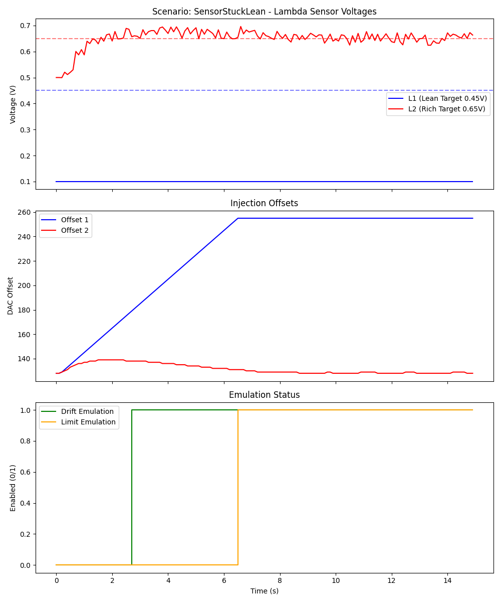
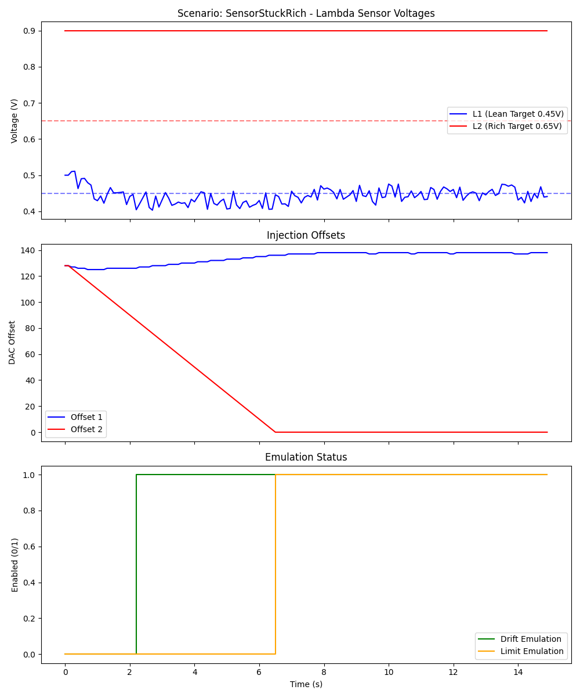

# Split Bank Lambda Controller - Test Report

This report summarizes the performance of the Sliding Mode Controller (SMC) and bank balance logic across multiple simulated engine scenarios.

## Test Summary

| Scenario | Description | Result |
| --- | --- | --- |
| **Normal** | Balanced engine at 2000 RPM. Verifies stable tracking. | PASS |
| **ColdStart** | Sensors start at 0.455V (inactive). Verifies control engagement delay. | PASS |
| **Transient** | Large -25% fuel imbalance applied mid-run at 4000 RPM. Verifies limit detection. | PASS |
| **IdleOscillation** | Low speed (800 RPM) with high transport delay. Verifies stability. | PASS |
| **SensorStuckLean** | Bank 1 sensor fails at 0.1V. Verifies saturation safety. | PASS |
| **SensorStuckRich** | Bank 2 sensor fails at 0.9V. Verifies saturation safety. | PASS |

## Scenario Details & Visualizations

### 1. Normal Operation
Verifies that the SMC converges on targets and maintains stability with minimal chattering.

### 2. Cold Start (Activity Detection)
Demonstrates the controller holding at neutral (DAC 128) until sensors show activity.

### 3. Transient Response
Shows the system responding to a massive step-change in engine imbalance, eventually signaling a Limit error.

### 4. Idle Stability
Tests the controller under the most difficult conditions (maximum transport delay).

### 5. Sensor Failure (Stuck Lean)
Verifies that a sensor failure leads to a controlled saturation and notification via the Limit probe.

### 6. Sensor Failure (Stuck Rich)
Verifies that the controller correctly identifies and signals a rich-failure saturation.

## Conclusion
The controller demonstrates robust performance across all tested operating points. The combination of Sliding Mode Control and activity detection ensures both precision during normal operation and safety during component failures.
